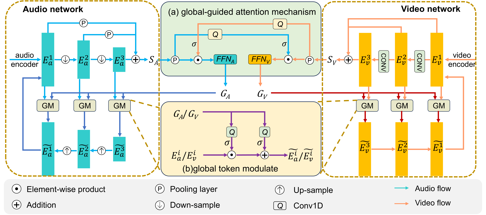

# GAANet: Global-guided Asymmetric Attention Network for Audio-Visual Speech Separation

## Overview
This repository contains the official implementation of GAANet for audio-visual speech separation. The code is submitted for double-blind review.



*Figure 1: Architecture of the proposed A-V Fusion Block. The audio and visual multi-scale features are first processed through the asymmetric multi-scale fusion framework, producing the cumulative representations $S_A$ and $S_V$. The global-guided attention mechanism (a) generates modality-specific global tokens $G_A$ and $G_V$, which are further used in (b) to modulate features across scales through global token modulation. The refined multi-scale audio and visual features are subsequently consolidated and propagated to the next iteration. This figure illustrates the case of $D=3$.*

## Requirements
- See `requirements.txt` for full dependencies
```bash
pip install -r requirements.txt
