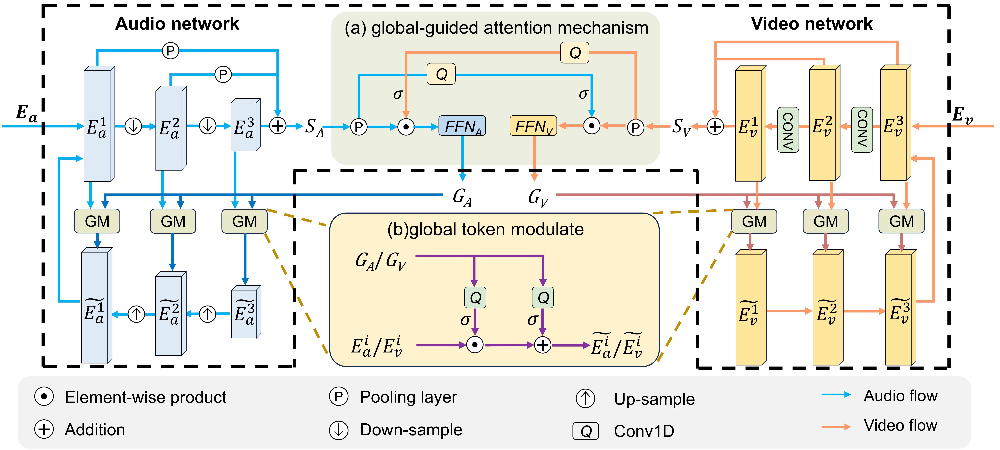

# 🌐GAANet: Global-guided Asymmetric Attention Network for Audio-Visual Speech Separation

## 📖Overview
This repository contains the official implementation of GAANet for audio-visual speech separation. The code is submitted for double-blind review.



*Figure 1: Architecture of the proposed A-V Fusion Block. The audio and visual multi-scale features are first processed through the asymmetric multi-scale fusion framework, producing the cumulative representations S<sub>A</sub> and S<sub>V</sub>. The global-guided attention mechanism (a) generates modality-specific global tokens G<sub>A</sub> and G<sub>V</sub>, which are further used in (b) to modulate features across scales through global token modulation. The refined multi-scale audio and visual features are subsequently consolidated and propagated to the next iteration. This figure illustrates the case of D=3.*

## 📋Requirements
- See `requirements.txt` for full dependencies
```bash
pip install -r requirements.txt
```
## 🏋️Train
```bash
python train_avnet.py --conf_dir configs/LRS2-GAANet.yml
python train_avnet.py --conf_dir configs/Vox2-GAANet.yml
```
## 🧪Test
```bash
python evl_testset.py --conf_dir Experiments/checkpoint/LRS2-GAANet/conf.yml
python evl_testset.py --conf_dir Experiments/checkpoint/Vox2-GAANet/conf.yml
```
### 🔍Inference
```bash
python evl_single.py
```

## 📦 Pretrained Models

We provide final trained models for evaluation and research purposes:

- **Final model trained on LRS2 dataset**  
  [Download LRS2 Final Model](https://1drv.ms/u/c/bcda40cf29d447bf/IQBFCn_HJdkaS4mW-BnyOCbSAT31utZLUlOA5xPY-BC3VUs?e=VMuwFj)

- **Final pretrained model**  
  [Download Pretrained Model](https://1drv.ms/u/c/bcda40cf29d447bf/IQDmAMGVENvUR4QZzIpApWEjAfnc4mvUzLFBERO3r2eoiJs?e=gn0kSO)

> **Note:** These models correspond to fully trained networks and can be directly used for inference and evaluation.

